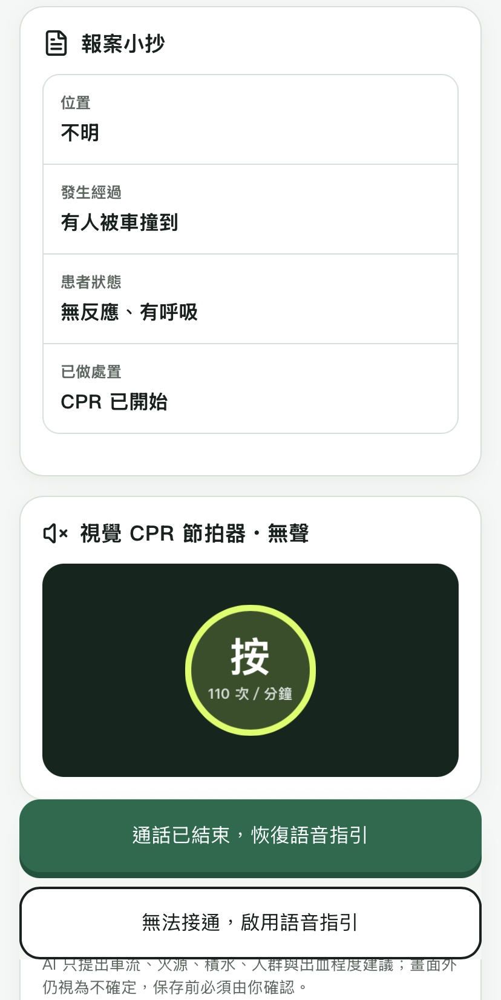
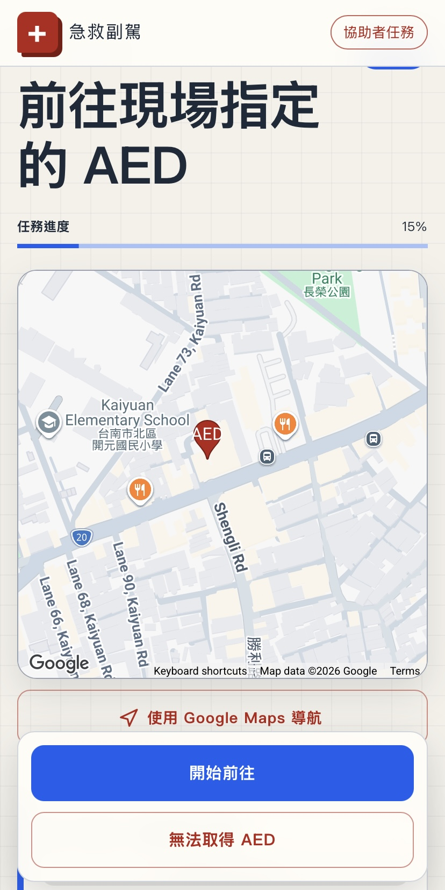
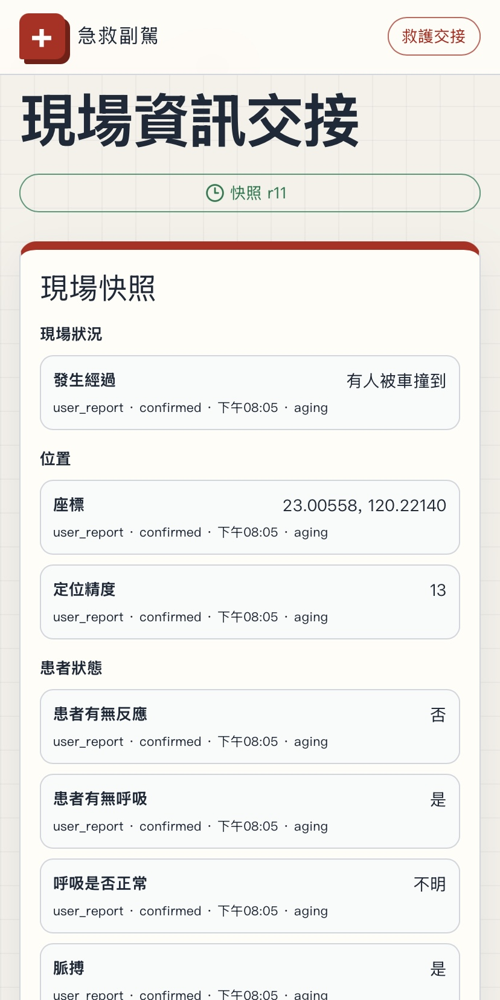
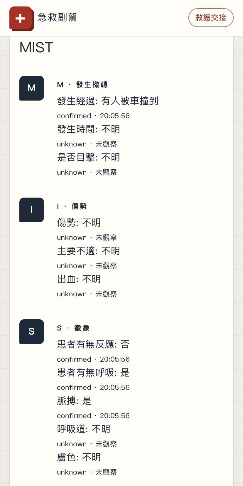

<h1 align="center">急救副駕 First Aid Copilot</h1>

<p align="center">
  <strong>派遣員指揮，Agent 輔助。</strong>
</p>

<p align="center">
  <a href="https://2026.meichuhackathon.org/">比賽官方網站</a> ·
  <a href="docs/Presentation.pdf">作品簡報</a> ·
  <a href="docs/Google_Challenge.pdf">Google 組題目說明</a>
</p>

<p align="center">
  
  
  
  
  
  
  
  
</p>

急救副駕是結合 Google Gemini 的急救協作原型，協助現場的人整理報案資訊、分派 AED 取件任務，並將觀察與處置紀錄交給救護人員。使用者透過手機瀏覽器，就能進入救援者、協助者或救護交接介面。

> 本原型的醫療判斷尚未經臨床驗證。任何緊急情況都應先聯絡 119；派遣員在線上時，以派遣員的指示為準。

🥉 本專案獲得 **2026 梅竹黑客松 Google 組第三名**。

## 我們想解決的問題

當意外發生，旁觀者往往需要同時報案、照顧患者、找人拿 AED，還要記住現場發生了什麼。慌張之下，位置可能說不清楚，其他人不知道該做什麼，重要的處置時間也容易遺漏。

急救副駕將這些資訊與協作工作集中在同一個介面。派遣員通話時，Agent 保持安靜，在畫面上提供報案小抄、記錄按鈕與 AED 取件進度；沒有派遣員指導時，才依規則引擎提供語音指引。

## 產品畫面

以下為產品操作畫面。畫面中的患者狀態與處置是操作回報，不代表經醫護確認的判斷。

<table align="center">
  <tr>
    <th>通話中的報案小抄</th>
    <th>AED 取件任務</th>
  </tr>
  <tr>
    <td align="center" valign="top"></td>
    <td align="center" valign="top"></td>
  </tr>
  <tr>
    <th>現場快照</th>
    <th>MIST 交接摘要</th>
  </tr>
  <tr>
    <td align="center" valign="top"></td>
    <td align="center" valign="top"></td>
  </tr>
</table>

## 使用流程

以下流程包含產品目標；目前的實作限制見[技術架構](#技術架構)。

### 1. 優先報案

打開介面，第一個畫面就是大型撥號按鈕，搭配一行現場安全提醒與開啟擴音的提示。如果旁邊有人，也會提醒使用者指定一人報案。撥號由手機系統處理，擴音則在通話介面開啟。目前原型的電話連結設為[新竹市政府總機](https://www.hccg.gov.tw/newBossMail/index) `03-5216121`（`tel:035216121`），不會撥打 119。這是實際市府電話，展示請使用模擬撥號，勿以測試為由撥出。啟動電話連結只記錄「已嘗試撥號」，使用者確認後才進入通話模式。

報案不需要先完成問答、註冊或等待模型載入。

### 2. 通話中安靜協助

畫面顯示大字「報案小抄」，整理位置、發生經過、患者狀態與已做處置，方便照著向派遣員說明。

使用者可以透過快速按鈕記錄「開始 CPR」「有人去拿 AED」等事件，系統自動加上時間戳記。此時 Agent 不說話，節拍器以畫面閃爍呈現；AED 派遣、取件追蹤與改派仍持續運作。

### 3. 通話結束或無法接通後，啟用語音指引

當通話結束，或嘗試報案卻無法接通時，系統才依規則引擎提供語音指引，並在適用的流程中提醒換手與再評估。

若使用者重新撥號，便回到靜音的通話模式，保留原本的紀錄與處置進度。由另一支手機報案，或系統無法確認通話狀態時，也能手動切換模式。

### 4. 救護到場交接

救護人員掃描 QR code，最上方即可看到「現場快照」，下方提供 MIST 摘要與完整時間軸。負責接應救護車的協助者，也能查看同一份快照。

MIST 摘要整理發生機轉或主要狀況、傷勢、觀察到的徵象，以及已做處置；沒有確認的資訊會保留不確定標示。

## 核心功能

| 功能 | 提供的協助 |
| --- | --- |
| 報案小抄 | 用大字整理派遣員需要的資訊，讓旁觀者可以照著說明。 |
| 現場快照 | 彙整地址、地標、樓層、入口、發生經過、患者狀態、已做處置、人數與危險資訊，標示確認狀態與更新時間。 |
| 快速記錄 | 用按鈕記錄關鍵事件，自動留下時間戳記，並允許補充與更正。 |
| AED 協作 | 讓協助者掃 QR code 接收取件任務、查看路線與回報進度，無須安裝 App。 |
| AED 自動改派 | 遇到大樓鎖門或設備無法取得時，改派其他候選位置並更新預估返回時間。 |
| 現場資訊輔助擷取 | 使用選取的鏡頭畫面協助填寫快照，辨識結果保留不確定性，由使用者確認。 |
| 視覺與語音提示 | 通話中以畫面操作與閃爍節拍為主；沒有派遣員指導時，才提供語音指引。 |
| 救護交接 | 將現場快照、MIST 與時間軸集中在同一頁，供救護人員快速掌握情況。 |
| 離線降級 | 保留本機紀錄、現場快照、按鈕操作與適用的本機規則；需要連線的功能明確標示不可用或資料已過時。 |

AED 協作是系統的核心功能之一。取件者抵達現場後，可以回報「已取得」或「無法取得」；系統據此調整任務。取件者的位置、預估返回時間與資料更新狀態，會回到主要介面，讓現場知道 AED 的進度。

## 技術架構

| 技術 | 用途 |
| --- | --- |
| React、TypeScript、Vite | 共用的手機網頁介面與前端建置。 |
| Python、Flask | REST API、權限驗證與後端服務。 |
| Google ADK、Gemini | Agent 整合、語音轉錄、文字與影像資訊擷取。 |
| Google Maps | AED 任務地圖與導航入口。 |
| PostgreSQL | 事故、事件、授權與現場快照的持久化。 |
| Docker Compose | 本機前端、API 與資料庫部署。 |

目前仍為原型，部分畫面使用合成資料。前端已有 IndexedDB 事件 outbox 與本機規則執行器；完整離線 PWA、地理編碼與臨床審查尚未完成。API 實作與整合限制請見[後端接入文件](agent/INTEGRATION.md)。

## AI 與急救規則

雲端模型採用 Google Gemini，協助理解輸入與整理觀察資訊。急救流程由可審閱的規則引擎決定，關鍵指引使用固定模板，規則與內容需要經醫護專業審閱。

模型不自行決定治療流程，也不會把鏡頭推測當成已確認事實。「建議進行某項處置」與「使用者回報已完成處置」會分開記錄，避免交接資料混淆。

## 快速開始

需先安裝 Docker Compose、Python 3 與 Node.js，並在支援 POSIX shell 的環境執行：

```sh
./scripts/setup-local.sh
docker compose up --build -d
node scripts/smoke-local.mjs
```

本機入口為 `http://127.0.0.1:8080`。手機存取、HTTPS、AED 資料匯入與 Gemini／Maps 設定請見[部署指南](docs/deployment.md)。

## 開發文件

- [系統設計](docs/sdd.md)：架構、資料模型與 API 契約。
- [後端接入](agent/INTEGRATION.md)：認證、權限、API 範例與整合限制。
- [協作規則](AGENTS.md)：模組分工與開發規範。
