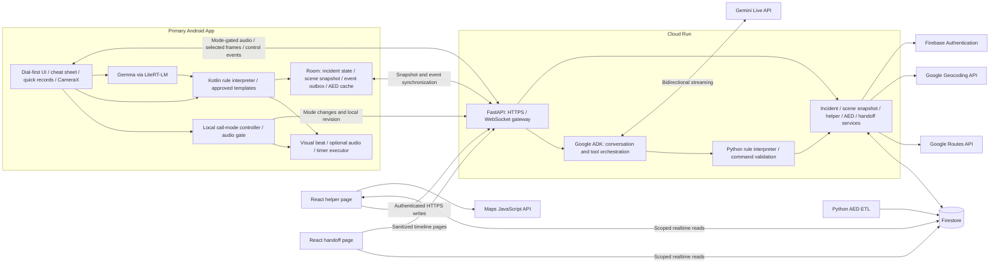
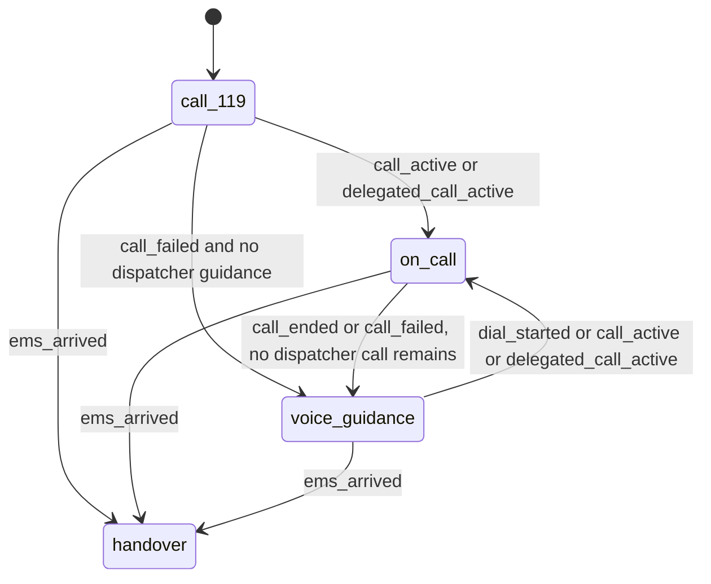

# First Aid Copilot — Software Design Document

Status: proposed architecture for the prototype. This document specifies the intended system, not an existing implementation.

Product name: 急救副駕 (First Aid Copilot). Primary interface language: Traditional Chinese (`zh-TW`). Initial operating context: Taiwan and emergency number 119.

> This is an emergency assistance prototype. Its medical decision-making has not been clinically validated. Users must be directed to contact 119 first and follow the emergency dispatcher's instructions whenever the dispatcher is on the line.

## 1. Product Definition and Scope

**The dispatcher leads; the Agent assists.** First Aid Copilot supplies the scene information, AED coordination, and event record that complement a dispatcher-led emergency response. During the call, the Agent stays silent and supports the bystander through a reporting cheat sheet, quick-event buttons, a continuously updated scene snapshot, and helper tracking. Rule-based voice guidance becomes available after dispatcher guidance ends or an attempted call cannot connect.

The main experience has four phases: immediate access to 119, silent support during the call, voice guidance when no dispatcher is guiding the scene, and snapshot-first handoff when emergency medical services (EMS) arrive. Call support and voice guidance can alternate within the same incident. Data recording and AED coordination continue across these transitions.

The system must support the following capabilities:

| ID | Capability | Required behavior |
| --- | --- | --- |
| F01 | Dial-first home screen | Show a large 119 dial action, speakerphone instructions, and a one-line scene-safety reminder on the first screen. Offer a prompt to designate another bystander to call while the primary rescuer attends to the patient. No assessment, registration, or network setup may block dialing. |
| F02 | Conditional voice interaction | Accept speech and provide rule-based spoken guidance only while no dispatcher is guiding the scene. Support interruption, repetition, correction, and large-button alternatives. |
| F03 | Rule-driven guidance | Support reviewed flows for assessment, CPR, severe bleeding, and recovery-position guidance within voice-guidance mode. Eligibility, transitions, contraindications, and uncertainty handling belong to the rule package. |
| F04 | Local visual and audio timing | Generate a flashing visual CPR beat locally, with metronome audio off during calls. In voice-guidance mode, allow audio and provide the requested two-minute rescuer-change and reassessment reminders within the applicable reviewed CPR flow. |
| F05 | Scene observations | Optionally use camera frames to propose structured fields for the scene snapshot, including visible hazards or bleeding. Camera access is never a prerequisite for emergency access or assistance. |
| F06 | Helper coordination | Create QR links for an AED runner and an ambulance greeter. Track tasks without requiring an installation. The greeter can also read the same current scene snapshot shown to EMS. |
| F07 | AED retrieval | Find candidate AEDs, display walking routes, track the runner and estimated return time, and select an alternative when an AED is unavailable. |
| F08 | Incident timeline | During calls, derive the timeline from quick buttons and background events. Retain observations, decisions, delivered instructions, acknowledged actions, helper updates, and reported treatment times across all modes. |
| F09 | Emergency handoff | Provide a scoped QR link with the scene snapshot first, then MIST and the complete timeline. Also show the local record on the phone when a remote page cannot load. |
| F10 | Offline continuity | Preserve the dial-first screen, call-mode silence, quick records, local snapshot, applicable rules, visual timing, and cached AED records. Use on-device Gemma for voice-mode understanding where supported, with a button-driven fallback. |
| F11 | Recovery and synchronization | Resume after connection loss without repeating completed actions, discarding offline history, or reverting to an older clinical state. |
| F12 | Temporary access and retention | Use incident-scoped permissions and expiring sharing links. Retain incident data only for the configured retention period. |
| F13 | Call mode | Automatically silence all Agent speech when a supported call signal is detected, stop Agent microphone capture, and show screen controls. Manual controls cover missing permissions, unobservable calls, and a call placed on another phone. |
| F14 | Reporting cheat sheet | Show large, readable location, incident circumstances, patient condition, and actions already performed so the caller can read them to the dispatcher. Unknown information stays visibly uncertain. |
| F15 | Scene snapshot | Maintain location details, circumstances, patient condition with confirmation labels, performed actions, people present, and hazards. Use the same versioned scene snapshot for the caller, greeter, and EMS views. |
| F16 | Quick-event controls | Provide buttons such as `CPR started` and `Someone is fetching an AED`, record their timestamps immediately, and allow corrections without erasing the original event. |

The prototype handles one patient per incident and one primary Android device controlling guidance. Multiple helpers may join the same incident. Its supported patient populations and exclusions must be declared in the reviewed rule package; the runtime must not infer that an adult flow also applies to children or other unsupported cases.

Diagnosis, medication recommendations, automated emergency dispatch, automatic AED operation, hospital-system integration, and multi-patient triage are outside this design. A model-generated answer is never a substitute for a missing rule.

## 2. System Architecture



Android is the primary incident surface because it integrates call-mode control, scene records, the local model, audio, camera, storage, and emergency-dialer access. Helper and handoff pages are mobile web pages hosted on Firebase Hosting. Cloud Run hosts the conversation gateway and application services; Firestore stores durable incident state and publishes scoped updates. The incident service creates one versioned scene snapshot that feeds the cheat sheet and the greeter and EMS views.

The baseline media path is Android → FastAPI → ADK → Gemini Live API. Firestore carries structured state, not audio or video. The Live API supports server-proxied streaming and direct client connections; a direct connection is an optional latency fallback using server-issued ephemeral credentials. Backend authorization and rule validation remain mandatory in either transport. [Live API documentation](https://ai.google.dev/gemini-api/docs/live-api)

Live voice streaming is active only in voice-guidance mode. During a call, structured input and optional permitted camera frames continue through the backend while microphone upload and all Agent playback are disabled locally. Gemini structured extraction can process selected frames independently of a spoken session. All cloud LLM integrations use Google Gemini; offline extraction uses local Gemma.

### 2.1 Decision and Execution Boundaries

| Component | Authority |
| --- | --- |
| Gemini / Gemma | Propose structured observations and provide bounded conversational support. Cannot select clinical transitions, invent instructions, or authorize device actions. |
| Rule interpreter | Determine the next allowed state, approved template IDs, action intents, and timer changes from validated inputs. |
| Incident service | Validate permissions and revisions, persist decisions, and issue commands while online. |
| Android call-mode controller | Immediately enforce silence and microphone suspension from local call signals or user controls. Cloud or model messages cannot override this gate. |
| Android runtime | Execute commands permitted by the current interaction mode, control visual and audio timing, persist acknowledgements, and run the local interpreter while offline. |
| Helper service | Validate task updates, calculate retrieval status, and perform deterministic AED reassignment. |
| Scene snapshot service | Project observed and reported facts into a shared, versioned snapshot without upgrading uncertain fields to confirmed facts. |
| Dispatcher / user controls | Give the dispatcher priority, report whether guidance is active on this or another phone, correct observations, and explicitly end the incident. |

The primary phone is the only guidance executor. While online, the server computes and commits rule decisions; while offline, the phone computes them using the same pinned rule package. Interaction mode is locally authoritative in either case. During a call, rules validate records and allowed background operations without issuing competing treatment instructions. A model session is replaceable and never serves as the sole incident memory.

## 3. Technology and Frameworks

| Layer | Selected technology | Purpose |
| --- | --- | --- |
| Android application | Kotlin, Jetpack Compose, AndroidX ViewModel, coroutines / Flow | Native interface and observable incident state. |
| Android hardware and audio | CameraX, Android audio APIs, foreground service where permitted, TextToSpeech | Optional frame capture, local audio, and approved spoken instructions. |
| Call-state adapter | `TelephonyCallback.CallStateListener` on supported Android versions, permission-aware subscription handling, manual mode controls | Detect observable calls and feed the local audio gate without requiring the app to become the default dialer. |
| Android persistence | Room | Durable snapshots, event outbox, command acknowledgements, and AED cache. |
| Android networking and identity | OkHttp WebSocket / HTTPS, Firebase Authentication SDK | Cloud connection and pseudonymous identity. |
| Android maps | Maps SDK for Android | Online AED map; cached AED lists remain usable without map tiles. |
| Offline understanding | Gemma through Google AI Edge LiteRT-LM; Android on-device speech recognition when available | Local structured extraction from speech transcripts. |
| Agent service | Python 3.12, FastAPI, Pydantic, Google ADK, Google Gen AI SDK | Streaming gateway, tool orchestration, schema validation, and model integration. |
| Rule package | Restricted YAML, JSON Schema, Python and Kotlin interpreters | Shared, reviewable state-machine definitions and deterministic execution. |
| Web application | TypeScript, React, Vite, Firebase Web SDK | Helper and read-only handoff routes in one application. |
| Routing and map display | Google Routes API, Maps JavaScript API | Server-calculated walking routes and browser map rendering. |
| Location description | Android location APIs, Google Geocoding API through the backend, editable location fields | Propose an address from coordinates and retain user-provided landmarks, floor, and entrance details. |
| Cloud persistence | Firestore, Firebase Admin SDK | Incident state, events, helper tasks, access grants, and AED records. |
| Hosting and secrets | Cloud Run, Firebase Hosting, Secret Manager | Backend hosting, static web hosting, and server-side credentials. |
| AED ingestion | Python ETL | Normalize government open data into searchable and downloadable records. |
| Verification | pytest, Kotlin/JUnit, Vitest, Playwright, Firebase Emulator Suite | Interpreter parity, service contracts, permissions, and end-to-end scenarios. |

LiteRT-LM is the preferred new Android integration. MediaPipe LLM Inference is a compatibility fallback only: its official guide now marks it as maintenance-only and recommends LiteRT-LM. Exact Gemma artifacts and device requirements must be validated on the target phone. [MediaPipe status](https://developers.google.com/edge/mediapipe/solutions/genai/llm_inference/android), [LiteRT-LM Android](https://developers.google.com/edge/litert-lm/android)

The Live API model ID is configuration, not a hard-coded product assumption. Select an available Live-capable Flash-family model after verifying audio, vision, tool use, and Traditional Chinese behavior in AI Studio. Pin the selected model and compatible SDK versions in the implementation; do not silently upgrade a deployed incident to a different model or rule package.

## 4. Application Modules and User Experience

### 4.1 Primary Android App

The first screen is the 119 entry screen. It contains one line reminding the user to consider scene safety, a large call action, a visible speakerphone reminder, and a short prompt to designate another nearby person to call while the rescuer attends to the patient. Scene safety is not a separate questionnaire or a gate before emergency access. Permission requests, GPS lookup, model startup, and account setup must not delay this screen.

During a call, the main surface is a large-type reporting cheat sheet with quick-event buttons, helper progress, and a visual beat when CPR has been reported as started. No spoken Agent interaction is expected. In voice-guidance mode, the surface shows one approved instruction, `Yes`, `No`, and `Unsure` controls where appropriate, repeat and correction controls, and optional metronome audio. All user-facing wording is concise Traditional Chinese.

The app contains these modules:

- **Incident controller:** coordinates observations, persisted incident state, commands, lifecycle recovery, and online/offline mode.
- **Call-mode controller:** combines supported OS call signals, dialer launches, delegated-caller reports, and manual controls into locally enforced mode transitions.
- **Audio controller:** gates microphone capture, model audio, local TTS, reminder sounds, and metronome audio before output reaches the device.
- **Guidance runtime:** executes the Kotlin rule interpreter, validated templates, timer plans, and visual / optional audio metronome commands.
- **Scene snapshot projector:** applies confirmed edits and event-derived updates to the local snapshot and renders the reporting cheat sheet.
- **Quick-event recorder:** stores one-tap reports immediately and provides corrections, distinguishing a reported action from an Agent command.
- **Offline extractor:** wraps speech recognition and Gemma behind an optional structured-observation interface.
- **Capture and location adapters:** supply explicitly enabled, permitted camera frames and location candidates without assuming a background camera can remain active while the system dialer is foregrounded.
- **Sync repository:** persists state and events before upload, retries safely, and restores the last usable state.
- **AED repository:** exposes cloud search and locally cached government AED records with freshness information.
- **Sharing and handoff:** displays helper QR codes, handoff QR codes, and the local scene snapshot followed by MIST and the timeline.

`call_119` means opening `ACTION_DIAL` with `tel:119` following an explicit user action. The system dialer may require the user to confirm the call. A dialer launch must be recorded separately from a user-confirmed connected call. The app does not assume it can hear, record, or share microphone access with a telephone call. [Android phone intents](https://developer.android.com/guide/components/intents-common#Phone)

The intended interaction is “Call 119 and enable speakerphone.” The baseline implementation guides the user to enable speakerphone in the system call interface; it does not promise to switch the emergency call's audio route itself. Android's preloaded dialer handles emergency calls, and in-call management APIs belong to a separate phone-app integration. Becoming the default dialer is outside this prototype. [Android InCallService](https://developer.android.com/reference/android/telecom/InCallService)

Call-mode entry stops all Agent speech, including helper announcements, cancels queued TTS / model playback, and stops Agent microphone capture. Metronome audio defaults to muted, with the baseline call mode using a visual beat only. The app returns to its cheat sheet when brought back from the system call UI; it does not overlay or replace that UI. A foreground session and persisted records support recovery, but uninterrupted execution under every OS restriction is not assumed.

### 4.2 Reporting Cheat Sheet and Scene Snapshot

The reporting cheat sheet is a large-type presentation of the same structured scene snapshot used for handoff. Its reading order is location, what happened, patient condition, and actions already taken, followed by people present and hazards. Field wording and order require review by emergency dispatch or rescue professionals.

| Snapshot field | Required content and provenance |
| --- | --- |
| Location | Coordinates with accuracy and capture time; address; landmark; floor; entrance or access instructions. Each descriptive field can be corrected independently. |
| Circumstances | What happened and the reported occurrence time, including `unknown` when the bystander did not witness the event. |
| Patient condition | Structured observations with visible `confirmed`, `reported`, or `uncertain` labels and last-observed times. |
| Actions performed | Reported CPR start, AED retrieval or arrival, and other supported actions with timestamps and source events. Requested or recommended actions remain separate. |
| People present | Reported patient count and bystander / helper count with active helper tasks. Additional patients are flagged as outside the single-patient flow. |
| Hazards | Reported or camera-proposed hazards with uncertainty labels. An empty field means unknown, not a safe scene. |

Reverse geocoding provides a candidate address; the user supplies or confirms landmarks, floor, and entrance details. A coordinate lookup cannot establish a building's correct access point. Network or permission failure leaves editable fields and any already known location available. [Google reverse geocoding](https://developers.google.com/maps/documentation/geocoding/guides-v3/requests-reverse-geocoding)

Camera extraction assists field completion and never silently overwrites a confirmed fact. Each field carries value, source, confirmation state, observed time, and evidence references. The deterministic projector chooses the current field values; any model-assisted wording must preserve those values and uncertainty. The snapshot carries `snapshotRevision`, `updatedAt`, and synchronization status. A stale or offline view is visibly labeled.

Quick-event controls include `CPR started`, `Someone is fetching an AED`, `AED arrived`, and `EMS arrived`, with additional actions only where the reviewed flow supports them. A tap records a user report locally before network work. `Someone is fetching an AED` does not claim an online helper accepted a QR assignment; those are separate events. Corrections append an amendment with the original reference and, when needed, an explicitly entered earlier occurrence time. The app does not infer performed treatment from elapsed time or a suggested instruction.

### 4.3 Helper Web Experience

The helper opens a QR link, receives a scoped session, sees one assigned task, and explicitly accepts it. An AED runner can report `Arrived`, `AED obtained`, `Unable to obtain`, and `Delivered`; an ambulance greeter sees the agreed meeting location and the same scene snapshot available to EMS, and can report arrival or completion. The greeter's snapshot grant does not grant access to the complete clinical timeline or to other helpers' location histories.

The AED page shows the destination, access notes, opening-hours status, walking route, retrieval progress, and return destination. Location sharing is requested only for the active task. If permission is denied, the task still supports manual status reports. If updates stop or the browser is suspended, the primary app shows the last-update time and marks the ETA stale.

Maps JavaScript renders the map. Routes API supplies route geometry and estimated travel duration; the app may offer an external navigation link. Embedded map display must not be described as a complete turn-by-turn navigation engine. [Routes API](https://developers.google.com/maps/documentation/routes/compute_route_directions)

### 4.4 Handoff Web Experience

The handoff page is read-only. Its first screen shows the scene snapshot: location and access, what happened, current patient condition and uncertainty, actions performed, people present, and hazards. MIST and the complete event timeline appear below it. MIST means mechanism / medical complaint, injuries, signs, and treatment. Unknown or unreported fields remain visibly unknown, with source events attached to populated fields. The EMS and ambulance-greeter views subscribe to the same scene-snapshot document and expose its revision and freshness.

The page distinguishes action recommendations from actions reported as completed. For example, displaying an AED instruction does not establish that a shock occurred; a shock time is recorded only from an explicit report and retains its provenance. When the network is unavailable, the primary phone provides the locally stored summary for direct viewing; a hosted QR page is not promised to work offline.

## 5. Rule Engine and Model Contract

### 5.1 Shared Rule Package

`rules/` is the single source for interaction-mode transitions, clinical state definitions, transition conditions, approved templates, action allowlists, timer definitions, and parity fixtures. The mode machine wraps the clinical flow so a new call can interrupt any clinical state. Each package carries `schemaVersion`, `ruleVersion`, `contentHash`, supported populations, clinical source references, review status, and compatible interpreter versions.

The rule language must be deliberately small:

- Named states with entry prompts, required observations, ordered transitions, and an explicit unmatched-input outcome.
- Boolean and enumerated comparisons plus `all`, `any`, and `not`; no arbitrary expressions or executable code.
- Explicit `true`, `false`, and `unknown` observation values. Missing input becomes `unknown`, never `false`.
- Allowlisted actions referring to approved templates and typed parameters.
- Timer start, cancellation, and expiry events tied to the state that created them.
- Mode-wide interrupts and output policies that apply to every clinical child state, including an immediate transition back to silent call support.

Both interpreters consume the same normalized schema and evaluation order. YAML parsing must avoid implicit type differences between runtimes, reject duplicate keys and unknown fields, and never instantiate arbitrary objects. The package loader rejects missing templates, dangling transitions, unsupported operators, and invalid timer references.

The initial mode is `call_119`, containing a scene-safety reminder rather than an independent safety-assessment gate. `on_call` allows factual recording, snapshot updates, AED coordination, and visual timing. `voice_guidance` contains the assessment, CPR, bleeding-control, recovery-position, AED-support, and reassessment flows. `handover` displays the snapshot-first record and silences automated guidance.

The requested CPR reminder interval is 120 seconds in the applicable voice-guidance flow. Its wording, clinical eligibility, and any exception must remain explicit in the reviewed rule package. Other clinical branching, conflict priority, and uncertainty handling are also defined there. The runtime cannot assume that every unknown value should enter the same treatment path.

### 5.2 Observation Contract

Each observation contains:

| Field | Meaning |
| --- | --- |
| `observationId`, `key` | Stable identifier and an allowlisted observation name, such as `responsive` or `breathing_normal`. |
| `value` | `true`, `false`, or `"unknown"` for boolean observations; other values require a declared schema. |
| `source` | `user_voice`, `user_button`, `camera`, or another explicitly supported source. |
| `observedAt`, `receivedAt` | Reported observation time and receiving-system time. |
| `confirmation` | `proposed` or `confirmed`, with the confirming event when available. |
| `evidenceEventIds` | References to source events; raw audio or images are not required for persistence. |

Gemini and Gemma output only schema-valid candidates. Invalid, ambiguous, conflicting, or stale evidence triggers the rule-defined clarification behavior. Model confidence is not clinical certainty. Camera output alone cannot establish that a scene is safe or that breathing is normal. High-impact observations require the confirmation policy declared in the rule package.

### 5.3 Decision and Delivery Contract

The interpreter returns a deterministic `Decision` containing `ruleVersion`, `interactionMode`, `modeRevision`, `fromState`, `toState`, `reasonCode`, accepted observation IDs, an optional `instructionTemplateId`, typed template parameters, permitted action intents, and timer changes. It does not call external services itself. In `on_call`, the decision may update factual records and background tasks but cannot initiate competing clinical instructions or spoken output.

The service commits the decision and its events before issuing device commands. Every command has a unique ID, expected state revision, expected mode revision, authority epoch, and expiry. Android validates these fields and its current local output policy, persists the command ID, executes the action once, and acknowledges the actual result. Expired or superseded commands are rejected, including after reconnection. Local call-mode entry takes effect before a cloud acknowledgement and invalidates queued speech from the previous mode.

Command records distinguish `received`, `started`, `completed`, `failed`, and `interrupted`. Metronome operations set a desired state idempotently. If the process dies between an external action and its acknowledgement, recovery marks the outcome uncertain and reconciles it instead of blindly repeating the action.

In `voice_guidance`, safety-critical instructions are rendered verbatim from approved templates using local TTS or packaged recordings. Free-form model audio must not be used as the delivery channel for those instructions: a prompt asking the model to preserve wording is not an enforcement mechanism. Live conversation may clarify input and describe coordination status only while the local audio gate permits it. Clinical follow-up answers must resolve to approved content or defer to the dispatcher. During calls, all acknowledgements and coordination updates are visual.

## 6. Incident Flow, Timing, and Offline Continuity

### 6.1 Four-Phase Interaction State Machine



| Mode | Entry and behavior | Exit condition |
| --- | --- | --- |
| `call_119` | First screen: call button, speakerphone reminder, one-line scene-safety reminder, and suggestion to designate a caller. Agent audio is silent. Record the dial attempt without claiming the call connected. | Observed / reported call activity enters `on_call`; a reported failed attempt with no dispatcher available enables `voice_guidance`. |
| `on_call` | Immediately mute all Agent output, stop Agent microphone capture, show the cheat sheet and quick buttons, and mute metronome audio. Continue logging, snapshot projection, helper dispatch, location tracking, and AED reassignment. | A reliably ended call or reported failed redial, with no other dispatcher guiding the scene, enables `voice_guidance`. Manual confirmation covers ambiguous or external-phone calls. |
| `voice_guidance` | Reconcile current observations and enter or resume the applicable assessment / clinical flow. Enable approved speech and optional metronome audio; run applicable two-minute CPR reminders. | Redialing, a detected call, or a reported delegated call immediately re-enters `on_call`, from every clinical child state. |
| `handover` | On an explicit EMS-arrival report, silence automated guidance and show the handoff QR and local snapshot, followed by MIST and the timeline. | The user explicitly completes handoff or closes the incident; merely viewing a QR code does not close it. |

`interactionMode` is separate from `clinicalState`, `connectionMode` (`online`, `offline`, `resyncing`), and incident `status` (`active`, `handed_over`, `closed`). A distinct `guidancePaused` flag permits a user pause without changing call facts. Moving between `on_call` and `voice_guidance` preserves treatment history and the clinical state; stale observations require rule-defined reassessment rather than blindly restarting the original assessment.

For online operation, the phone records button input or permitted speech / camera candidates, the backend validates them and projects the scene snapshot, and the rule service evaluates the current mode and clinical state. Committed events update the phone, helper views, and handoff view. All screen and audio effects pass the local mode gate. On-call work must continue through structured APIs without requiring an active Live voice session.

### 6.2 Call Signals and Local Priority

On supported devices, use `TelephonyCallback.CallStateListener` with the required `READ_PHONE_STATE` permission and appropriate subscription registration. These callbacks report mobile-call states for registered subscriptions. The design treats them as activity signals, not proof that a particular dispatcher has answered. Relevant multi-SIM subscriptions need coverage; an unobserved or unauthorized subscription cannot be assumed idle. [Android call-state listener](https://developer.android.com/reference/android/telephony/TelephonyCallback.CallStateListener)

The call-mode adapter normalizes OS and user events into `dial_started`, `call_active`, `call_ended`, `call_failed`, and `delegated_call_active`. It records the source and uncertainty. Dialing or redialing closes the audio gate immediately, before waiting for a connection. Confirmed call activity keeps it closed. A reliable return to idle can resume guidance only if no delegated or other reported dispatcher call remains active. Returning to the app, losing audio focus, a network timeout, or silence on the microphone is not evidence that dispatcher guidance ended.

Persistent controls let the user report `Dispatcher is on the line`, `Someone else is calling`, `Call ended`, or `Could not connect`. Manual control is required when permissions are denied, OS callbacks are unavailable, or another person's phone is used. An active local call signal takes precedence over a request to enable voice; ambiguous transitions retain silent support until clarified. A user-reported external dispatcher call is cleared explicitly, not by the primary phone's idle state.

Every change increments `modeRevision`, updates the local audio gate synchronously, and appends `mode.changed` for synchronization. Entering `on_call` flushes pending speech and blocks old voice frames even if the cloud has not received the new mode. Leaving it resumes from the current facts after checking pause and audio-focus state; it never replays a queue of prompts generated during the call. Handoff and closure remain silent when later call events arrive.

### 6.3 Timers and Audio

The backend persists rule-defined timer plans with `timerId`, originating revision, duration, and cancellation conditions. Android is the sole visual and audible timer executor in both online and offline modes and uses a monotonic clock during an active device session. Timer expiry is recorded as an event, and a clinical state change invalidates timers that no longer apply.

The CPR metronome is generated locally. Its rate and enabling conditions come from the reviewed rule package and are not model output. A quick `CPR started` report can activate the visual beat during a call; it records the rescuer's action rather than issuing a new treatment command. `on_call` uses a flashing indicator with metronome audio muted. In `voice_guidance`, audio can be enabled and the applicable 120-second timer delivers approved rescuer-change and reassessment reminders. A reminder does not automatically stop compressions or transition to another treatment.

Changing call mode, losing the network, or replacing a model session must not reset elapsed treatment time. Reminders that become due during a call are recorded without spoken delivery, and resuming guidance does not replay a backlog. The current clinical rules determine any relevant reminder after resumption. Visual beats require the app to be visible; the UI must not imply they remain visible over the system dialer or on a locked screen.

Cloud Run WebSockets are subject to request timeouts, and a reconnect can land on another instance. Durable snapshots and timer plans therefore live outside the process. Active backend sessions can observe timer events, but correctness must not depend on an in-memory coroutine surviving indefinitely. [Cloud Run WebSockets](https://docs.cloud.google.com/run/docs/triggering/websockets)

After process death or device reboot, the app restores persisted history and makes the interruption visible. A monotonic timestamp from a previous boot is invalid; the app must reconcile timer state and request any necessary current observation rather than replaying accumulated reminders.

### 6.4 Offline Capability Levels

Internet connectivity and telephone-call state are independent. Opening the emergency dialer does not require the app's internet connection, but successful calling still depends on the phone and available emergency-call service. Loss of mobile data never triggers a switch out of `on_call` or enables Agent speech by itself. The local mode controller, quick-event recorder, and scene snapshot remain available without cloud services.

| Available capability | Behavior |
| --- | --- |
| Local recognition and Gemma ready | In `voice_guidance`: speech → local transcript → structured candidates → confirmation → Kotlin rules → approved local speech. In `on_call`: no Agent microphone capture or speech. |
| Gemma unavailable, slow, or invalid | Large answer buttons and optional text input feed the same rules directly; no model is required to continue. |
| Local speech recognition unavailable | Use buttons immediately. Do not route supposedly offline recognition to a network service. |
| TTS voice unavailable | Display approved text and use packaged prompts where available, always respecting the call-mode gate. |
| Snapshot enrichment unavailable | Keep quick-button updates and editable location / scene fields. Camera inference and reverse geocoding may be unavailable; retain their last values with freshness and uncertainty labels. |
| Cloud AED or routing unavailable | Show cached AED addresses, straight-line distance and direction, access notes, and cache age. Do not fabricate a walking route or live ETA. |
| Cloud coordination unavailable | Preserve known helper status as stale. Local assistance continues under the current interaction mode, while new remote assignments and live tracking are explicitly unavailable. |

The app must check on-device recognition support and installed language resources rather than assuming Android always offers offline speech. Model and voice downloads belong to device preparation, never the emergency entry path. [Android SpeechRecognizer](https://developer.android.com/reference/android/speech/SpeechRecognizer)

### 6.5 Synchronization and Single Guidance Authority

The phone durably stores an outbox before sending events. Each event has a stable UUID, device ID, device sequence, authority epoch, mode revision, and rule version. The server acknowledges event IDs and deduplicates retries; helper reports are independently identified. Mode changes and quick records participate in the same ordered event stream.

When connection health fails, the primary phone increments its local authority epoch, rejects older cloud guidance, and continues from its last committed snapshot. During resynchronization it remains the executor while uploading the ordered offline branch. The backend reconciles that branch transactionally against the last shared revision using the pinned rules, merges independent helper events, and returns an acknowledged snapshot and fresh authority epoch before online decisions resume.

An incompatible rule version, conflicting primary device, or unreconcilable snapshot keeps the phone in local mode and records a conflict. Server receipt time must not overwrite the sequence of offline clinical events. Commands that were completed locally are never reissued as new actions, and old model responses cannot rewind the current state.

The latest local interaction mode wins over an older server snapshot throughout reconciliation. Resynchronization cannot unmute a current call. The incident-state snapshot used for recovery is distinct from the user-facing `sceneSnapshot`; synchronization rebuilds the latter from accepted events and reports its new revision to the caller, greeter, and EMS views.

## 7. AED Search and Helper Coordination

### 7.1 AED Dataset

The ETL reads the selected Taiwan government AED open-data source, validates coordinates, normalizes addresses and access hours, and deduplicates records using stable source identifiers. Every published record contains `aedId`, name, location, address, access notes, hours with timezone, source URL, source update time when available, ingestion time, and dataset version.

The exact dataset endpoint and reuse conditions must be verified before ingestion. Missing opening hours remain `unknown`. ETL retains the last valid dataset when an import fails and reports rejected records. Android receives a versioned regional cache of the government records; offline map tiles and cached Google route results are not assumed.

### 7.2 Search, ETA, and Reassignment

1. Use an indexed geographic candidate lookup, such as geohash bounds followed by exact distance filtering. A raw Firestore query is not assumed to provide nearest-neighbor search.
2. Exclude AEDs reported unavailable in the current incident and identify known access restrictions. Rank candidates using availability information and walking-route estimates when available.
3. Estimate arrival back at the patient: runner → AED plus AED → patient, with a separately labeled retrieval-time assumption. After collection, use runner → patient. Show estimate freshness and uncertainty.
4. When the runner reports an access failure, persist the reason, invalidate the previous assignment, choose the next usable candidate, and publish a new assignment revision. The runner acknowledges the updated destination. The primary app shows the change visually during a call and may announce it using a template only in voice-guidance mode.
5. If no candidate remains, report that no accessible candidate is known. Do not cycle repeatedly through failed locations or present a guessed destination.

A helper task moves through `offered`, `accepted`, `en_route`, `arrived`, `collected`, `returning`, and `delivered` as applicable. It can also become `unavailable`, `cancelled`, or `expired`. An ambulance-greeter task uses the relevant subset. Status transitions and AED reassignment are transactional and idempotent, preventing duplicate runners or stale reports from silently completing a new assignment.

Helper location records include timestamp and accuracy. A foreground browser tab is the expected tracking surface; stale updates reduce ETA confidence and never imply the helper is still moving. When the phone is offline, helpers with connectivity may continue their existing cloud tasks, but the phone cannot claim to have received those updates.

Helper dispatch, tracking, ETA calculation, and reassignment are application-service operations independent of the Live audio session. Entering `on_call` must not cancel or pause these tasks. The ambulance greeter reads the shared scene snapshot alongside meeting instructions; the AED runner retains only the information needed for retrieval and return.

## 8. APIs and Event Contracts

All backend operations derive actor identity from the authenticated session. Incident IDs or role names supplied by a model are not sufficient authorization. Pydantic validates incoming payloads, and shared schema fixtures verify TypeScript and Kotlin serialization.

| Interface | Contract |
| --- | --- |
| `POST /v1/incidents` | Register an authenticated, locally generated incident UUID and return its initial cloud snapshot. Retry with the same UUID is idempotent. |
| `WS /v1/incidents/{id}/live` | Authenticate before accepting media; exchange typed control envelopes and mode-permitted audio / image frames. Resume from acknowledged event IDs, state revision, and mode revision. The control channel may remain active while call mode suspends voice. |
| `POST /v1/incidents/{id}/events:sync` | Accept ordered event batches, including call-mode changes and quick records, online or after an outage; return per-event acknowledgements, conflicts, and the reconciled incident state. |
| `POST /v1/incidents/{id}/scene-observations` | Accept typed snapshot-field reports or corrections with evidence and expected snapshot revision; project an updated snapshot without silently confirming model proposals. |
| `POST /v1/incidents/{id}/location:describe` | Return candidate address data for the reported incident coordinates; permit user correction and preserve location accuracy and source. |
| `POST /v1/incidents/{id}/shares` | Create a role-scoped, expiring invitation for a helper or handoff viewer. |
| `POST /v1/share-sessions:exchange` | Exchange an invitation secret for a scoped authenticated session; never use a raw QR secret as Firestore authorization. |
| `POST /v1/incidents/{id}/helpers/{helperId}/updates` | Accept an authorized helper's own location or task update with the expected assignment revision. |
| `GET /v1/incidents/{id}/aeds` | Return ranked candidates and explicit route / availability freshness. |
| `GET /v1/incidents/{id}/handoff/events` | Return a cursor-paginated, field-filtered timeline to an authorized primary session or handoff viewer. |
| `POST /v1/incidents/{id}/close` | Close the incident, cancel pending actions, and revoke helper access; handoff read access follows its explicit expiry. |

The control envelope includes `protocolVersion`, `messageId`, `incidentId`, `actorId`, `type`, `clientTime`, `deviceSequence`, `authorityEpoch`, `stateRevision`, `modeRevision`, and a typed `payload`. Control types include `mode.changed`, `call.reported`, `action.reported`, `event.corrected`, `observation.proposed`, `observation.confirmed`, `decision.committed`, `command.issued`, `command.acknowledged`, `timer.elapsed`, `helper.updated`, `incident_state.updated`, `scene_snapshot.updated`, and `error`.

`mode.changed` carries previous mode, new mode, call-signal source, and reason. `action.reported` distinguishes the tap time from any user-entered occurrence time and never implies the app observed the action. `scene_snapshot.updated` carries `snapshotRevision` and the source-event boundary so different surfaces can show whether they reflect the same facts.

Media frames carry session and sequence metadata and negotiated content types. The gateway limits frame size, buffering, and input rate; it drops stale optional camera frames before allowing them to delay control messages. Audio format and limits follow the selected Live API model configuration.

Voice frames are tagged with the current mode revision. Android discards frames from a prior mode and blocks playback in call or handover mode even if the server makes a mistake. Reopening a voice session restores current context without replaying conversation audio from before the call.

### 8.1 Agent Tool Surface

| Tool | Execution and constraints |
| --- | --- |
| `get_next_step(observations, expectedRevision)` | Server evaluates validated observations with the current rule package and interaction mode. A stale state or mode revision fails; call mode returns only permitted background or factual updates. |
| `log_event(type, detail, idempotencyKey)` | Server accepts only allowlisted event schemas and preserves source attribution. It cannot manufacture a confirmed treatment event. |
| `find_nearest_aeds(lat, lng, k)` | Server performs geographic filtering, availability handling, and bounded route lookup. |
| `dispatch_helper(role)` | Server creates an appropriate invitation or reuses an existing active task; it does not silently create duplicate assignments. |
| `get_helper_status()` | Server returns status, freshness, and ETA provenance for the authorized incident. |
| `analyze_scene(image)` | Server returns typed scene-snapshot observation candidates only, preserving uncertainty. Raw image content has no authority to issue tools or override instructions. |
| `update_scene_snapshot(observations, expectedSnapshotRevision)` | Server validates source and confirmation labels and updates the deterministic projection from accepted events; the model cannot mark its own inference confirmed. |
| `call_119()` | Android exposes the user-initiated dialer action and returns the actual result. |
| `start_metronome()`, `stop_metronome()` | Android executes a permitted rule command or local user control; call mode always uses the visual output policy. |

`mute_agent`, `show_cheat_sheet`, `mute_metronome_audio`, and `show_handover_qr` are deterministic local mode-entry actions. Resuming Agent audio is an effect of an allowed transition into `voice_guidance`, not a model-callable override. Quick buttons call the event recorder directly and do not wait for an LLM tool call.

Tool requests are proposals until application authorization and state validation succeed. Every mutation uses an idempotency key and returns a typed result. Expected failures include `unauthorized`, `expired`, `stale_revision`, `rule_mismatch`, `unavailable`, and `invalid_input`; the user interface translates these into short actionable messages.

## 9. Persistence and Access Control

### 9.1 Firestore Layout

```text
incidents/{incidentId}
  createdAt, updatedAt, expiresAt, ownerUid, primaryDeviceId
  status, interactionMode, modeRevision, clinicalState, guidancePaused
  callStatus: {value, source, observedAt, delegatedCallActive}
  ruleVersion, stateRevision, authorityEpoch
  location, observations, timerPlans, lastAcknowledgedDeviceSequence
  mist: {mechanism, injuries, signs, treatment}
  events/{eventId}
    type, detail, source, actorId, deviceId, deviceSequence
    clientTime, serverTime, modeRevision, authorityEpoch, ruleVersion, expiresAt
  sceneSnapshots/current
    snapshotRevision, updatedAt, generatedThroughRevision, expiresAt
    location: {coordinates, accuracy, address, landmark, floor, entrance}
    circumstances, patientCondition, actionsPerformed, peoplePresent, hazards
  helpers/{helperId}
    uid, role, status, assignmentRevision, targetAedId
    location, locationUpdatedAt, locationAccuracy, eta, etaUpdatedAt, expiresAt
  helperViews/{helperId}
    assignment, destination, accessNotes, routeSummary, status, expiresAt
    sceneSnapshotRef  # Present only for an authorized ambulance greeter
  handoffViews/current
    sceneSnapshotRef, mist, confirmedObservations, timeline
    generatedThroughRevision, expiresAt
  grants/{grantId}
    uid, scope, helperId, expiresAt, revokedAt

shareInvites/{inviteId}
  secretHash, incidentId, scope, helperId, expiresAt, redeemedAt, revokedAt

aeds/{aedId}
  name, location, geohash, address, hours, accessNotes
  sourceUrl, sourceUpdatedAt, ingestedAt, datasetVersion
```

`sceneSnapshots/current` is the canonical shared scene summary; its content fields use the provenance envelope from Section 4.2 even where the layout above abbreviates the values. The caller's cheat sheet, the ambulance greeter, and EMS render this same record rather than generating independent summaries. Android keeps a local projection for immediate and offline use and identifies changes not yet synchronized. Current-condition and performed-action summaries are bounded; the complete history stays in events.

`handoffViews/current` is a bounded summary with a reference to the shared scene snapshot. The complete handoff timeline is provided through the authorized, paginated handoff API with an explicit field allowlist; it must not grow without limit inside one Firestore document. Handoff viewers cannot read raw event documents directly. Helper views contain task-relevant information, with scene-snapshot access granted specifically to the ambulance greeter. MIST fields retain evidence references and distinguish confirmed, reported, and unknown values. Projections expose their generated revisions and catch up if a projection write fails.

Events are append-only apart from retention deletion. Corrections append a new event referencing the corrected one. Cloud `serverTime` records receipt, while `clientTime` and device sequence preserve the reported chronology. Clock uncertainty is visible instead of silently rewriting timestamps. Canonical state changes use Firestore transactions and expected revisions; materialized views identify the revision they represent.

### 9.2 Authentication and Permissions

The Android app uses Firebase anonymous authentication when online, with a local installation identity available before authentication succeeds. Offline-created records become cloud records only through authenticated registration and synchronization.

A QR code contains an opaque, high-entropy invitation secret, not patient data. The web client exchanges it over HTTPS; the backend checks expiry, redemption, revocation, and scope, then binds a pseudonymous user to an incident grant. Firebase custom-token sign-in can establish the session. Continued access is checked against the grant, independently of authentication-token lifetime. [Firebase custom authentication](https://firebase.google.com/docs/auth/admin/create-custom-tokens)

| Actor | Allowed access |
| --- | --- |
| Primary session | Read its incident and submit authorized observations, control requests, sharing requests, and offline events. |
| AED runner | Read its own retrieval task and submit its own task and location updates. No access to the clinical scene snapshot, MIST, raw events, or other helpers' location histories. |
| Ambulance greeter | Read its own task and the shared scene snapshot, including the condition and performed-action summary needed to brief EMS. Submit only its own task updates. No MIST / full-timeline access or other helpers' location histories. |
| Handoff viewer | Read the shared scene snapshot, designated MIST summary, and sanitized timeline until the grant expires. No mutation permission. |
| Backend service identity | Perform validated canonical writes and view projection under restricted IAM permissions. |

Client Firestore access is read-only and deny-by-default; writes go through the backend. Security Rules enforce scope, grant status, and expiry for direct listeners, including separate authorization to read `sceneSnapshots/current`. A greeter's reference to that document is not itself authorization. Backend APIs perform the same checks because Admin SDK access does not rely on client Security Rules. Sensitive fields must be separated into suitable documents or server-filtered responses rather than assuming field-level hiding inside a readable document.

### 9.3 Privacy and Retention

The product does not request patient names, identification numbers, or contact details. Incident location and clinical observations are still sensitive. Dispatcher calls are not recorded or transcribed by the Agent. Raw voice-mode audio, frames, and full transcripts are not retained by default; production logs exclude tokens, clinical payloads, and exact coordinates. Model-provider data handling is part of deployment configuration and must not be described as zero retention without verification.

Set an explicit `expiresAt` on every temporary document and enforce access expiry immediately in application authorization. Firestore TTL deletion is asynchronous and does not delete child subcollections when a parent expires, so TTL policies must cover each temporary collection group. Local Room data and transient browser state also need expiry cleanup. [Firestore TTL behavior](https://firebase.google.com/docs/firestore/ttl)

Invitation lifetime, grant lifetime, incident retention, and helper-location retention are separate configuration values. Revocation blocks future requests but cannot erase information a viewer has already seen. Shared web sessions use memory-only sensitive state where practical, clear it on expiry, and remove invitation secrets from the address bar after exchange.

## 10. Deployment, Configuration, and Failure Behavior

Cloud Run hosts one backend application with separated streaming, rule, incident, scene-snapshot, helper, AED, and location-description modules. Firebase Hosting serves the React routes over HTTPS. Service credentials and unrestricted model / routing / geocoding keys stay on the server; public map keys are restricted to the intended Android application or web origins and APIs.

Configuration covers model IDs, rule package versions, supported populations, call-detection capabilities, the reviewed CPR reminder interval, token and data lifetimes, AED dataset selection, region coverage, stale-location / snapshot thresholds, audio and frame limits, retry policy, and feature availability. Rule packages are pinned for the duration of an incident. An optional direct-to-Live transport must preserve the same local call-mode gate, rule and command boundary, and server-only long-lived credentials.

| Failure | Required behavior |
| --- | --- |
| Live API unavailable or slow | Continue structured call-mode work without voice. In voice-guidance mode, use local rules and approved prompts and report reduced conversational capability. |
| Firestore or backend unavailable | Persist events and scene-snapshot changes locally, switch computation to the local runtime while preserving interaction mode, and show remote helper data as stale. |
| Call detection unavailable or ambiguous | Retain the local silence policy and expose manual call / delegated-caller controls. No callback is not proof that a call ended. |
| Geocoding or location unavailable | Keep editable address, landmark, floor, and entrance fields; label any retained location with its age and uncertainty. |
| Camera unavailable during the call | Continue with quick records and manual scene fields. Do not invent fresh observations or block the cheat sheet. |
| Route lookup unavailable | Show an address and explicitly labeled distance estimate; do not substitute it for walking ETA. |
| Microphone or camera denied | Continue with buttons; camera remains optional. |
| Model output invalid | Discard the candidate and request structured clarification. |
| Duplicate or delayed command | Return the prior acknowledgement or reject the obsolete revision without executing again. |
| QR invitation expired or revoked | Show an expired-access page containing no incident data. |
| App interrupted or restarted | Restore history and scene snapshot, recheck local and delegated call state, identify interrupted delivery, and reconcile before permitting any spoken output. |

Operational metrics include call-signal-to-mute latency, prohibited audio deliveries during call mode, quick-event persistence latency, snapshot projection lag, voice response latency, dropped media frames, reconnects, sync lag, command acknowledgement latency, rule rejection counts, helper update age, and model fallback frequency. Metrics use incident pseudonyms and omit raw medical content.

## 11. Required Verification and Acceptance

These are requirements for the intended implementation, not claims that the current repository has passed them.

| Area | Acceptance condition |
| --- | --- |
| Shared rules | Every fixture in `rules/cases/` produces identical interaction / clinical states, template IDs, actions, and timer changes in Python and Kotlin, including call interrupts, unknown values, and conflicting inputs. |
| Instruction boundary | Model output cannot execute unapproved actions, modify clinical templates, bypass observation confirmation, or open the local call-mode audio gate. |
| Emergency access | The first screen exposes 119 access, a one-line scene-safety reminder, speakerphone instructions, and the caller-delegation prompt before permission, network, or assessment work. Dialer launch is not a confirmed connected call. |
| Call-mode silence | Call entry immediately stops Agent playback and microphone upload, clears queued speech, and leaves visual timing available. No Agent speech, reminder sound, or metronome sound is delivered while `on_call`, including during AED reassignment. |
| Reversible modes | Call end or reported failure enables current-state voice guidance when no other dispatcher call remains. Redialing interrupts every clinical child state. Delegated calls and denied / missing callbacks work through manual controls; data loss never counts as call end. |
| Quick records and cheat sheet | A quick button persists its event before network work and updates the displayed facts. Reporting fields stay readable in the intended order, and corrections preserve provenance and earlier reports. |
| Scene snapshot consistency | Caller, greeter, and EMS views show the same fields for a given snapshot revision, including uncertainty and freshness. Camera output and reverse-geocoded addresses cannot silently replace confirmed input. |
| Local continuity | On the supported test device, losing connectivity preserves call-mode silence, visual timing, quick records, local scene snapshot, and event history. Voice-mode button input works with Gemma and recognition disabled. |
| Reconnection | Repeated uploads, delayed cloud commands, instance replacement, and offline branches do not duplicate actions, rewind clinical state, or overwrite the current local interaction mode. |
| CPR reminders | The applicable voice-guidance fixture emits the requested reminder at each 120-second interval. Call-mode transitions retain elapsed treatment time, suppress spoken reminders, and prevent a catch-up burst after the call. |
| Helper loop | A reported inaccessible AED results in one revised assignment, an acknowledged new target, and an updated or explicitly unavailable return ETA. |
| Handoff | The scene snapshot appears above MIST and the complete timeline. All views match evidence, mark unknowns, and distinguish suggested actions from performed-action reports. |
| Access control | Cross-incident reads, runner access to the scene snapshot, greeter access to the full clinical timeline, expired grants, revoked invitations, and unauthorized writes are denied in emulator and API checks. Greeter snapshot access succeeds only with the correct grant. |
| Retention | All temporary collection groups and local records expire as configured; access ends even while physical TTL deletion is pending. |
| Device behavior | Physical-device checks cover noisy speech, denied permissions, multi-SIM call signals where supported, speakerphone setup, dialer transitions, audio focus, background restrictions, process restart, and missing offline resources. |

### 11.1 Demonstration Scenarios

1. **Reporting with and without the cheat sheet:** use the same scripted emergency and a simulated dispatcher to compare reporting duration and completeness. The dial-first screen must be visible before data entry, and the call-mode screen must make location and uncertainty easy to read aloud.
2. **Silent assistance during the call:** a bystander follows the simulated dispatcher and practices on a training manikin while quick records appear in the timeline, the visual beat runs, the AED runner moves, an inaccessible AED triggers reassignment, and the scene snapshot updates. No Agent speech is played.
3. **Voice takeover and redial:** end the simulated dispatcher call, resume rule-based guidance from current facts, and exercise the applicable two-minute reminder. Redial during guidance to verify immediate silence while helper tracking continues; end the call again without resetting treatment history.
4. **Snapshot-first handoff:** a simulated EMS recipient scans the QR code and identifies location / access, patient condition, performed actions, and hazards. The usability target is comprehension within 10 seconds of scanning, including page access time. The greeter sees the same snapshot revision, while MIST and the full timeline remain available to EMS below it.
5. **Connection-loss variant:** disconnect the data path during a simulated call. Silent support, buttons, snapshot edits, and visual timing continue; reconnection merges records without unmuting the call or repeating actions.

Demonstrations simulate 119 rather than placing a real emergency call. Device call-state integration can be checked with non-emergency test calls. Evaluation records reporting duration and completeness, call-mode audio violations, snapshot correctness, time from call end to permitted guidance, AED retrieval duration, handoff comprehension and completeness, rule parity, and voice latency where applicable. Record the phone, network, model, and scenario with the measurements. These prototype and simulation results are not clinical efficacy evidence.

## 12. Intended Repository Structure

```text
mchackathon/
├── android/                 # Call-mode controller, incident UI, local runtime, and storage
├── web/                     # React helper, shared snapshot, and handoff views
├── agent/                   # FastAPI, ADK, scene projection, coordination, and data services
├── rules/
│   ├── schema/              # Rule and observation schemas
│   ├── flows/               # Versioned interaction-mode and clinical state machines
│   ├── templates/           # Reviewed instruction text and localized content
│   └── cases/               # Shared Python/Kotlin parity fixtures
├── data/                    # AED ETL and dataset validation
├── eval/                    # Scenario simulation and evaluation
└── docs/
    └── sdd.md               # This design document
```

The structure above defines the intended implementation boundaries. Clinical rule content, cheat-sheet wording and field order, supported device profiles, exact model identifiers, the government AED source, and retention settings remain explicit configuration and validation decisions; they must not be filled in through model guesses.
